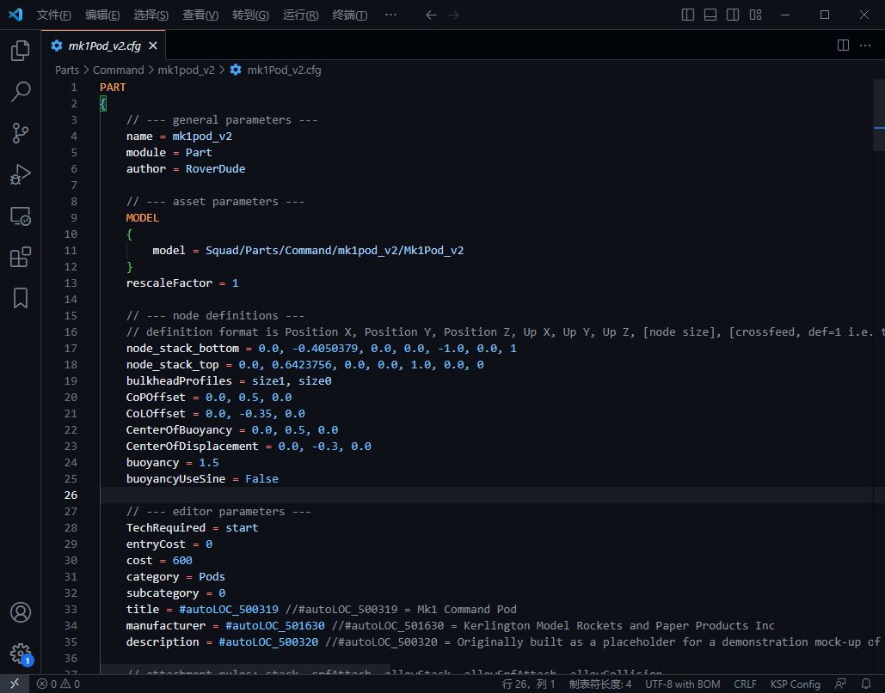
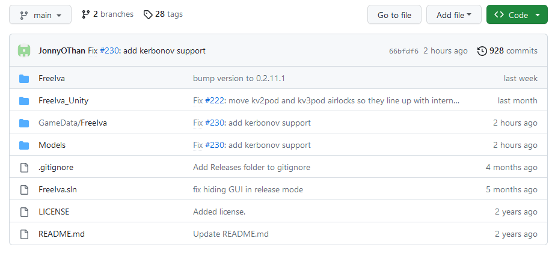
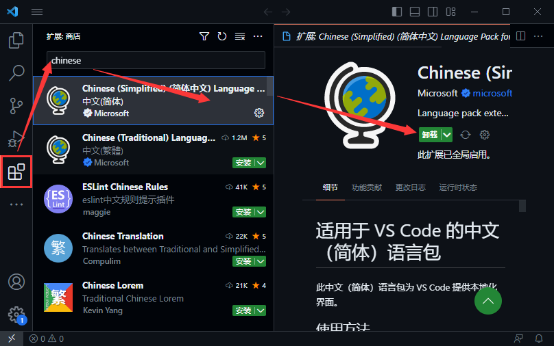
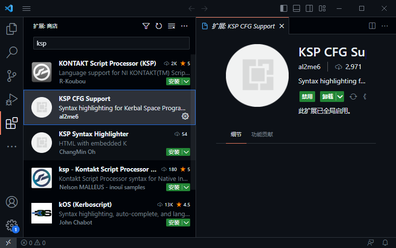
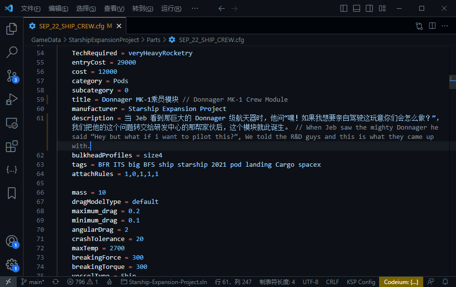
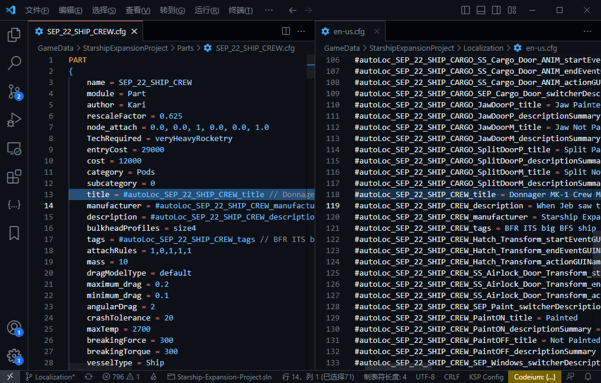
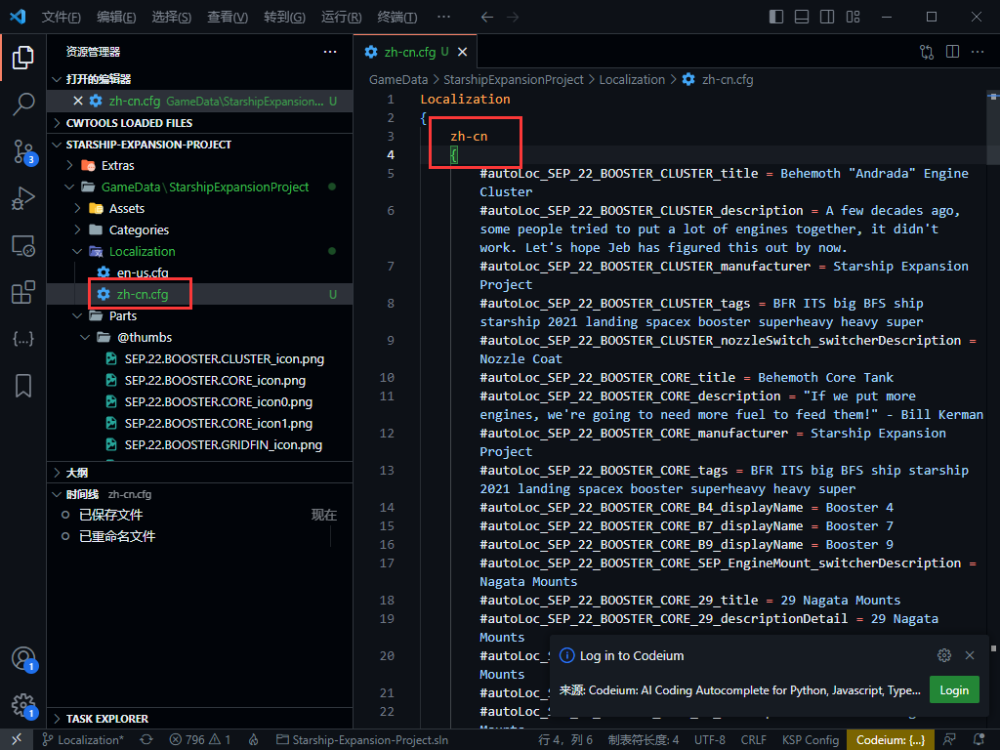
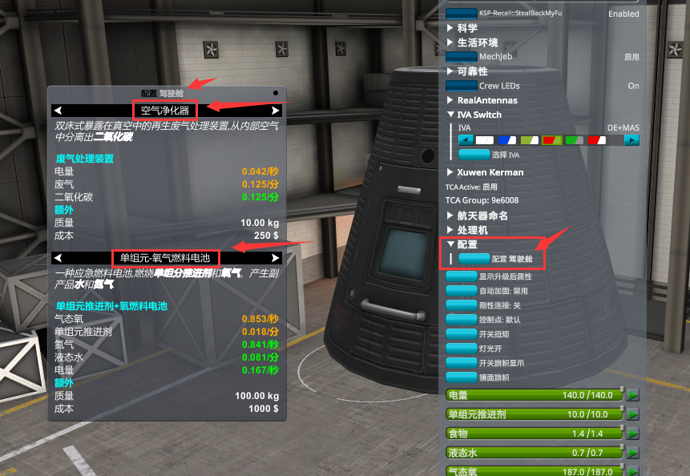
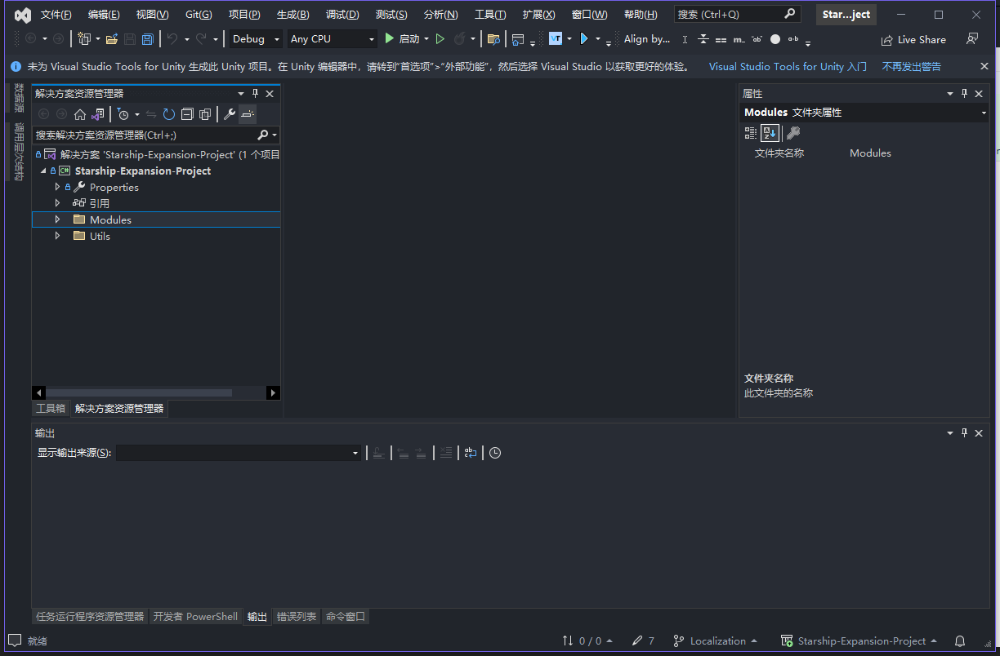
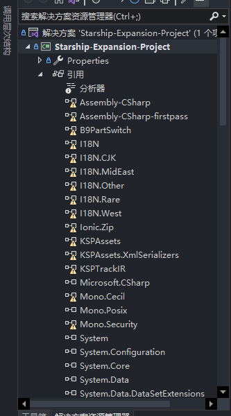

#  KSP Mod 汉化流程大纲

# 零、前言

此为坎巴拉太空计划 1 的 Mod 汉化大纲。相信存在相当一部分人在游玩了大量的不支持中文/本地化的 Mod 后，萌生了想要自己做汉化的想法，但是鉴于国内 KSP 社区的封闭性以及我国互联网的一些特殊性，与其他游戏相比，很多应该出现的教程全都没有出现或是遗失。

本人于 2019 年入坑了坎巴拉太空计划，迄今为止为许多 KSP 社区 Mod 实现了本地化/添加中文翻译，要挑几个有工作量的 Mod 出来，主要有 MechJeb2 和 Kerbalism。这期间也积累了很多有用的知识，因为大学专业性质，主要积累了大量的 C# 编程技巧，也半只脚踏入了汉化 Unity 游戏的大门，当然啦，还有很多航天相关的知识。

希望这能够帮助到那些想要自己能够手动汉化 KSP Mod 的中国 KSP 玩家。

# 一、工程结构

## 1. 目录结构

拿到 mod 先不要急，首先查看 mod 目录下的结构，此步的目的是粗略判断自己未来的工作量以及判断 Mod 的类型。

看目录看什么呢？首先看目录下是否存在诸如`"Localization"`、`"en-us"`等字眼的文件夹或`.cfg`文件，最好使用 VS Code 将整个 Mod 的目录直接打开查看整个目录结构，VS Code 的使用后续章节会说到。

如果有，就说明了 Mod 作者已经全部或部分实现了多语言支持，先暗暗窃喜一番，但是也别急，接着往下看。

如果没有，那就惨了，等于从零开始，工作量飙升，不过不要紧，我相信在看这个的各位都是有毅力、能吃苦、勤劳的、伟大的、秉承中华优良品质的、有服务精神的中国游戏玩家。

### 基础知识

首先需要讲解一下 KSP 原版目录下的各个文件夹的作用，即目录的一般存放命名规则，这个规则也同样适用于 Mod，除了旗帜外其他的文件的存放不会很严格，但一般 Mod 作者都会这么整理他们的文件

在`GameData\Squad\`下你可以看到下列的结构（版本：1.12.5）：

```
/Agenices/                    -- 原版机构组织信息
/Alarms/                      -- 原版闹钟音效和图标
/Contracts/                   -- 一些合同的相关文件
/Controls/                    -- 键盘布局相关文件
/Experience/                  -- 小绿人的经验、特质定义
/Flags/                       -- 存放旗帜图片的，在“选择旗帜”界面中会出现在“综合”分类下。这个文件夹的名称必须是大写开头Flags，小写的flags不行
/FlagsAgency/                 -- 与Flags文件夹的意义一样，不过在“选择旗帜”界面中会出现在“航天局”分类下
/FlagsFlagsOrganization/      -- 与Flags的意义一样，在“选择旗帜”界面中会出现在“机构”分类下
/FX/                          -- 尾焰或者其他的视觉效果文件
/Interiors/                   -- 管理大厦建筑的背景图片
/KSPedia/                     -- 右下角蓝色火箭白皮书按钮里的 KSPedia 页面
/Localization/                -- 各个语言的翻译文件存放处，这是我们的这个大纲的主要核心内容
/MenuProps/                   -- 游戏主菜单界面背景砸到Mun地面航天器上的“不到 Mun 决不罢休”贴图
/Missions/                    -- 一些 ESA（欧空局）的场景任务
/PartList/                    -- 建造界面的左边筛选分类的图标
/Parts/                       -- 游戏中的各种部件（引擎、燃料箱、指令舱等等）
/Plugins/                     -- 对于 Mod 来说一般放入 DLL 插件
/Props/                       -- 舱内视角（IVA）、导航球等一些图片元素，称为 Prop，大多数为 dds 文件，可以用 PS 安装 NVIDIA Texture Tools 打开
/Resources/                   -- 内容比较杂，存放游戏中定义的各种“资源”，比如液体燃料的定义、科学实验的结果文本都在这个里面。
/Sounds/                      -- 一些声效
/Spaces/                      -- 跟Props差不多
/Strategies/                  -- 管理大厦建筑的内容，包括各部门的定义、策略效果等
/Tutorials/                   -- 教程相关的载具
/zDeprecated/                 -- 已经不推荐使用的东西比如一些旧版本部件，Deprecated 是那种已经不使用了，但是为了兼容性仍然存在没有立刻删掉的东西
```

## 2. 文件结构

这里主要是对 KSP 中的 `.cfg` 配置文件的内容结构进行简单的解释，这是为了后续能够读懂我说的字段在哪个地方。

这里以原版游戏目录中的 GameData/Squad/Parts/Command/mk1poad_v2/mk1Pod_v2.cfg 的部件（Mk1 指令舱）文件进行解释。

如果用 VS Code 打开文件会是这样的（如果你没有安装插件是不会有语法高亮功能的）



简化一下图中的信息可以看到

```
PART
{
    name = mk1pod_v2
    module = Part
	author = RoverDude
    ...
}
```

可以看到是这样的一个结构。首先，这个 `PART { }` 在 KSP 中会被视为一个 `Node`，意为节点，下面提到的 Node 都是用来表示节点这个东西（这不是在中文社区闲着没事给你放洋屁，考虑到目前 KSP 的整体中文社区环境相对于其他游戏来说，对萌新没有那么的友善，所以这是为了方便后续的萌新在学会查阅英文资料后能够知道 Node 代表的是什么东西，不会产生那么多的分隔感），Node 的一般形式是

```
Node
{
    Field = Value
}
```

所以上面文件中的内容表示定义了一个Node，类型为 PART，里面有诸多内容，比如 `name = mk1pod_v2`、`module = Part` 等这些 `Field = Value` 的 `字段/键 = 值`对。继续往下接着看文件，可以发现 `Node` 里面是可以继续存在添加 `Node` 的：

这是在 PART  Node 里的 MODEL Node

```
MODEL
{
    model = Squad/Parts/Command/mk1pod_v2/Mk1Pod_v2
}
```

这是另一个名称为 INTERNAL 的 Node

```
INTERNAL
{
    name = mk1pod_IVA
}
```

还有更多等等等等，反正看到诸如这样的 `XXXX {}` 形式，就代表 `XXXX` 是一个名称为`XXXX`的一个`Node`，好了你已经大致知道了 KSP 的配置文件长什么样了，并且有了 Node 和 Node 中的 `字段=值` 的概念，接着往下看。

# 二、辨认文本

不要忘记我们是来汉化的，其实汉化的最本质行为就是找到文本，然后替换为我们的语言，抽象出来就是【搜索】，然后【替换】。

下面将让你大致认识 KSP 中的文本。


## 1. 认识部件（PART）

部件是 KSP 中文本最多的东西了，继续以我们的“**Mk1 指令舱**”部件为例，查看原版文件的一大好处就是可以很容易看到哪些字段被本地化了，下面将筛选出来这些字段，未包含注释`//`后面的内容

```
PART
{
	...
	title = #autoLOC_500319
	manufacturer = #autoLOC_501630
	description = #autoLOC_500320
	...
	tags = #autoLOC_500321
	MODULE
	{
		...
		defaultControlPointDisplayName = #autoLOC_6011003
		CONTROLPOINT
		{
			displayName = #autoLOC_6011004
			...
		}
	}
	MODULE
	{
		...
		toggleName = #autoLOC_502011
		eventOnName = #autoLOC_502012
		eventOffName = #autoLOC_502013
	}
	MODULE
	{
		...
		experimentActionName = #autoLOC_502009
		resetActionName = #autoLOC_502010
		reviewActionName = #autoLOC_502200
		...
	}
	MODULE
	{
		...
		reviewActionName = #autoLOC_502201
		storeActionName = #autoLOC_502202
		...
	}
	MODULE
	{
		...
		baseDisplayName = #autoLOC_8007117
		VARIANT
		{
			displayName = #autoLOC_8007119
		}
		VARIANT
		{
			displayName = #autoLOC_8003112
			...
		}
	}
}
```

可以看到我摘出来的这些`字段（Field）`等于号后面的`值（Value）`都有一个共同的地方，那就是这些值都是以`#autoLOC_`开头的，这些值实际上相当于一个【变量】，可能用 C 语言的【宏定义】（`#define`）概念来解释更加准确，习惯于称这个东西为`Tag`，完整的叫`Localization Tag`，翻译过来叫“本地化标签”。在游戏加载时，当读取到这文件时，所有的这些 **字段** 的 **值** 都会被替换为：已读取到的、内容包含 `Localization {}` 节点内的、当前游戏语言的、字段名称与之相同的 值 的内容。这些值已经在其他文件中的`Localization { }`节点中被定义好了，像原版中，你可以在`GameData\Squad\Localization\dictionary.cfg`文件中找到各种`#autoLOC_xxx`的字段。

里面的`<<1>>`是啥我会在 DLL 插件的汉化方法里说明，其实是指代写在 DLL 里的变量，现在只是让你大概认识一下本地化字段和值的样子。

```
Localization
{
	zh-cn
	{
		...
		#autoLOC_18451 = 引擎功率<<1>>%
		#autoLOC_18491 = 进行EVA实验
		#autoLOC_18516 = 燃料用量<<1>>%
		...
		#autoLOC_500319 = Mk1指令舱
		#autoLOC_500320 = 本来是用于在一支展示用模拟火箭顶端临时占位置的部件。全世界的火箭科学家们都声称Mk1指令舱远比前代机型更为安全可靠。现在经常能看到其执行任务。
		#autoLOC_500321 = 太空舱 方位 控制 ?eva 飞行 陀螺 ?舱内 动量 飞行员 反应 火箭 太空 稳定 转向 扭矩
		...
		#autoLOC_501630 = 坎灵顿模型火箭和纸制品有限公司
		...
		#autoLOC_6011003 = 默认
		...
		// 自己打开文件看看喽 //
	}
}
```

所以上面的`title`字段中的`#autoLOC_500319`值在游戏中就变成了`Mk1指令舱`。

## 2. 认识 MM Patch

这个内容属于大多数 mod 的前置依赖 mod - Module Manager 的内容，为了方便下面用 MM 来指代它。MM 提供了一系列操作 KSP 配置文件（CFG）的方法，方便那些 Mod 制作者可以在不修改原文件的情况下对原版或是其他 mod 的内容进行修改——你只需要写个 "patch"（补丁） 就可以轻松做到。这个 patch 能够对原版的 CFG 配置文件中的节点进行一系列操作（取决于你要实现什么），但需要遵循由 MM 定义的语法规则（好在不是很难）。应用场景有如你对原版某个引擎的性能感到不满意，想要自己“修复”一下。

因为相当部分的 mod 在制作过程中使用到了 MM 来对部件的名称等字段进行了添加、修改操作，所以关于 MM 的语法我认为是有必要学习的，能够帮助翻译工作的正常展开。

下面举个例子，属于 Mod `Kerbalism` 的内容，在路径 `GameData/KerbalismConfig/System/Habitat.cfg` 中可以找到：

```
@PART[mk1pod,mk1pod_v2]:NEEDS[FeatureHabitat]:AFTER[KerbalismDefault]
{
	@title ^= :(.)$:$0 (UNPRESSURIZED) :
	@description ^= :(.)$:$0\n\n<color=orange>Unpressurized.</color> Bring your own space suit. :

	@MODULE[Habitat]
	{
		max_pressure = 0.3
	}
}
```

节点前的`@`属于 MM 语法规则中的编辑修改操作，对了，这整个文件就是称为一个 patch 文件，忘了说了。

先不说后面的 NEEDS 和 AFTER 是啥，第一行的意思是让 MM 找到 name 为 mk1pod 和 mk1pod_v2 （我们亲爱的 Mk1 指令舱）的 PART 节点
然后`@title`意为修改节点中的`title`字段，`^=`操作符代表使用正则表达式进行值的【操作】，第一个字符`:`将会被识别为分隔符，实际上可以用其他字符代替，但最好保持用冒号，除非你的语句中需要冒号，分隔符用来分隔正则匹配字段和值，接下来的`(.)$`则是正则表达式的语法内容，其中`$`意为匹配字符的末尾，`(.)`意为匹配任意字符，换行符除外。扯远了，这一行修改的内容是：在 title 后面添加`\n\n<color=orange>Unpressurized.</color> Bring your own space suit.`字段，`<color=orange></color>`这种类似于网页中的标签写法在 KSP 中是可以识别的，实际上属于 Unity 中的富文本（rich-text）内容，所以后续的翻译工作中遇到类似于这种文本形式，就不要翻译，保持原样，千万不要整个翻译为`<颜色=橙色>未加压。</颜色> 带上你的太空服。`，你只需这样`<color=orange>未加压。</color> 带上你的太空服。`就可以了。

`@description`的功能和上述一样。

那么，这两个字段(`@title`和`@description`)都是可以本地化的，方法跟部件文本一样，后续讲。


## 3. DLL 类 (plugin，插件) 硬编码文本

这种就是 Mod 作者不搞本地化然后直接写在代码里的文本，文本在经过编译后成为了 DLL 文件的一部分，这种情况下，在不修改代码的前提下，没有多少办法能够修改它，可能可以利用 BepInEx + XUnity.AutoTranslator 来达成目的，但是未经测试不太好说，而且根据处理其他游戏的经验，这种做法处理的汉化效果都不太好。

既然只有修改代码这一条路，那么在踏上此路前必须要有一定的 .net C# 基础和 Unity 基础，没有基础，看不懂代码的运行逻辑，胡乱修改，然后导致运行不正常。然后这里的基础除了基本的代码理解和工具使用之外，还需要一项基本技能，那就是正确使用搜索引擎和正确提问的能力，不要遇到什么问题都直接拿出来问。

在具有了一系列基础之后就可以开始根据 Mod 的开闭源情况来选择相应的工具进行代码修改了。对于那些闭源的 Mod ，我们可以利用一些反编译工具例如 dnspy 进行反编译 - 修改 - 再编译即可达成目的，但是其过程可能会非常艰辛。对于开源，这是最理想的情况，使用任何 IDE 直接对代码修改，然后编译就行。

所幸的是，KSP 的官方社区规定（搜索 Add-on Posting Rules）只要发布了这种需要 DLL 实现功能的插件类型 Mod 都需要开源自己的代码，所以一般都能在 GitHub 上或是 GitLab 等代码托管平台找到相关的源码。

那么 Mod 的开源了又该如何下手呢？拿最近做的 `FreeIVA` （舱内自由移动）这个 Mod 作为例子：[GitHub 链接指路]( https://github.com/pizzaoverhead/FreeIva)

进入网页后可以看到该 Mod 的工程文件结构是这样的，不同 Mod 的工程结构会有不同，但是大致方向都差不多。



在这个 Mod 中，通过文件夹名称就可以一览其类型，首先，很明显的，`FreeIva`和`FreeIva_Unity`对应的肯定是 Mod 的 C# 源码和 Unity 工程文件，`GameData/FreeIva`则是发布文件夹，即未来放在游戏目录下 `GameData` 中的安装文件夹。可以看到有个FreeIva.sln文件，这是 VS 的 解决方案文件（Solution），可以直接用 VS 打开。即下载好源码后可以直接打开。

那么对于 DLL 的本地化/汉化，主要是要修改源码，所以主要过程就是修改 `FreeIva` 文件夹内的内容，里面有很多的 .cs 文件。


# 三、工具准备

在进入真正汉化战斗之前，你需要工具，工具为 1 个文本编辑器（本大纲选用 VS Code），1 个 Git 工具（可选，为了提交给作者），根据目标 Mod 的情况，可能还需要一个 .NET C# 的 IDE，可选微软（Microsoft）的 Visual Studio 或是 JetBrains 的 Rider，IDE 的下载如读者没有 C# 编程基础可以跳过。

还能说啥呢？没有 VS Code 的先下个 VS Code ，本章内容与 VS Code 息息相关，如果你使用其他文本编辑器，那可跳过本章。哦对了，是 Visual Studio Code 不要下成 Visual Studio，两者有很大区别，如果你还想要汉化 DLL 插件里的文本，那都下载也无妨。

## 下载

关于它们的下载网上一搜一大把，不是很想浪费篇幅写。如果 Mod 是纯添加部件的 Mod 比如 FASA，那么你只需要 VS Code 和 Git【可选】

## 使用

### 中文的 VS Code

下载安装后打开 VS Code，第一步是什么呢？不为别的先切换个中文，VS Code 的中文需要安装一个扩展（Extension），这个东西就相当于 VS Code 的 mod。在 VS Code 界面左边有一堆图标，找到如下图中的按钮，点击然后在弹出来的搜索框输入"Chinese"，很快的，出现了一个地球仪图标且标题为`Chinese (Simplified) (简体中文) Language Pack for Visual Studio Code`的选项，直接点击它右边的绿色背景白色字体的`Install`进行安装，好了之后右下角会叫你"change language and restart"切换到中文，点击之后 VS Code 会重启，重启后界面就变成中文。 




### KSP CFG 语法高亮插件（可选）

接下来安装另一个插件来让我们的 CFG 文件可读性强一点，在刚才的扩展窗口中搜索`KSP`然后选择 `KSP CFG Support`，安装后打开KSP的CFG文件你就可以有语法高亮功能了，功能的高亮显示主要是对 MM 的语法高亮，对于大多数 CFG 文件来说足够了。



### Git（可选）

因为大多数 Mod 的都存放在 GitHub 上，所以需要一个 Git，除此之外你还需要注册一个 GitHub 账号。安装 Git 和注册 GitHub 账号的主要目的是为了不让自己的工作白做了，给自己留个存档，或者本地化工作完成后给原作者提交一个合并请求，等于是一人做本地化，全玩家受益，Mod 支持多语言等于为未来注入新鲜血液提供了潜力，降低学习成本，给予 Mod 作者正反馈，心理得到了满足，开发完善 Mod 的动力被激发，慢慢出现一个良好的、和谐的社区风气，形成正向循环。
这里也可以选择 GitHub 自家的 GitHub Desktop 代替 Git 的命令行操作，这需要一个 GitHub 账号登录使用。

#  四、开始行动

下面介绍本地化中常用的一般流程和常规方法。

## 0.基本方法

选个目前没有人做本地化的 Mod 作为例子，本节选用 Mod - "**Starship Expansion Project**"，这是个相对来说比较纯粹的部件类型的 Mod，有少量简单的硬编码文本，作为入门来说，用来练手是非常合适的。

首先找到并进入该 Mod 的 [GitHub 页面](https://github.com/Kari1407/Starship-Expansion-Project)。操作目的是为了将整个项目下载并存在我们的电脑某处。

**[可选]**如果你电脑安装了 Git 且安装了 GitHub Desktop 那么直接在那个绿色的写着`<>Code`的按钮上点击，弹出的下拉菜单中选择`Open with GitHub Desktop`，设置好存放路径后会直接帮你拉取(pull)整个仓库(repository)。

**[可选]**如果只有 Git 那么需要先在电脑内某个文件夹内调出 Git 窗口，使用 Git 命令来拉取，但是本文重点不是这里。所以请搜索一下。

如果啥都无，那我只能认为你只想自己汉化自己用~~（你个自私的 bastard）~~，直接下载ZIP，在绿色的 Code 网页控件上点击，然后点击Download ZIP。下载完成后解压。

在解压后的目录，打开右键菜单，选择`通过 Code 打开` 来打开整个项目文件夹，如果没有添加右键打开的选项，可以先打开VS Code，文件 - 将文件夹添加到工作区，可以看到整个工程的结构：

```
> Extars
> GameData\StarshipExpansionProject
> Source
License + Changelog.txt
README.md
```

在翻译之前先简单说说翻译的原则，翻译主要讲究信、达、雅，但在实际的过程中比较难做到，所以建议不要过分追求这个 3 个东西，翻译一个游戏 Mod 而已，不是在翻译什么世界名著，只要做好起码的信和达就好，在信的最低前提下能够读起来通顺自然，整体的可读性是高于一切的，所以也不要太过于拘泥于原文，太过于拘泥于原文在某些情况下会导致翻译出来的效果非常的硬，整条语句读起来不自然。

翻译过程中请保持翻译的前后一致性，尽量做到同一个单词或同一个词根演变而来的词在上下文中的译法保持统一。也请尽量参考游戏自带的官方译法。

## 1.常规字段文本替换

先看一眼整个的文件结构有没有诸如`Localization`之类的东西存在，很明显没有，倒是在`GameData\StarshipExpansionProject\Plugin\`中找到了一个`en-us.cfg`点开后对字段进行全局搜索，发现并不属于此 Mod 的内容，而是另外一个 Mod `Stockalike Station Parts Expansion Redux`的英文翻译。那么很明显，作者并没有实现任何的本地化，这说明我们有活干了。

### 直接修改

采用直接修改方法就很简单，进入各种 CFG 文件看到啥就直接改成中文然后保存。如图所示：



这种修改方式不是非常推荐，只要作者来一次小小的更新，你就等于白做了，如果只是给自己用，那么更加推荐使用下面的 MM Patch 的方式。

还是推荐有能力的读者能够注册一个 GitHub 账号，采用本地化的方式来对 Mod 进行真正意义上的“汉化”。

优点是快，遇啥改啥，有能力的还能写个自动化工具进行一键翻译。

注意修改完成保存后右下角的编码应为`UTF-8`或`UTF-8 with BOM`，文件不是这个编码保存的，别过来问我怎么修改后中文是乱码。上图中为 UTF-8。

### 本地化

按照顺序，容易的先来，先将部件的文本给本地化了，本地化起手定式：在 Mod 根目录下新建 Localization 文件夹、新建 **en-us.cfg** 文本文件，这一步你可以是通过手动创建的方式，也可以自己写个工具来实现。

打开空白的**en-us.cfg**文件，称本地化文件，下同，添加 `Localization {}` 节点，然后在节点内再添加一个`en-us{}` 节点，如下示例代码：

```
Localization
{
	en-us
	{
		...这里就是未来要加上的本地化标签
		#autoLoc_XXXX = XXXX // 这里的命名规则可以任意，我习惯上使用 【# + Mod名称缩写 + 下划线 + 部件名 + 下划线 + 当前字段名】如下行所示
		#SPE_22_SHIP_CREW_title = Donnager MK-1 Crew Moudle
	}
}
```

然后依次找到各个部件文件将其中的各个可本地化字段（title、description等）替换为刚才在本地化文件中创建的本地化标签。



图为本人使用自己编写的工具自动创建的结果。可在我的[GitHub链接](https://github.com/tinygrox/Starship-Expansion-Project/blob/Localization/GameData/StarshipExpansionProject/Localization/en-us.cfg)上查看完整的文件。

假设你现在已经改完所有的部件文件了，也手动生成了一个英文版本的本地化文件，接下来就是进行我们最后的中文翻译工作。

直接复制一份刚才的本地化文件 **en-us.cfg**，更改文件名为 **zh-cn.cfg**，然后打开，将文件内的en-us节点名替换为zh-cn，然后保存，如图所示：



来到部件汉化流程的最后一步：翻译。

接下来的工作就非常简单了，直接翻译每个本地化标签后的英文原文为中文就好了，这里就不放图了。

那么对于 **Starship Expansion Project** 这个 Mod 来说，部件的本地化工作已经完成。的确还有少量的英文文本出现在游戏中，但那不属于部件的范畴了，需要对DLL插件的代码进行修改才行了。

## 对待 MM Patch

对于MM Patch，回到之前提到的 Kerbalism 自带的配置文件夹中的 `GameData/KerbalismConfig/System/Habitat.cfg` 文件，对于 Patch 文件，该如何本地化呢？答案是原封不动的复制到本地化标签就可以了。以下是示例：

在原 Patch 文件

```
// 原 Patch 文件
@PART[mk1pod,mk1pod_v2]:NEEDS[FeatureHabitat]:AFTER[KerbalismDefault]
{
	@title ^= #KerbalismConfig_UNPRESSURIZED_title // :(.)$:$0 (UNPRESSURIZED) :
	@description ^= #KerbalismConfig_UNPRESSURIZED_desc // :(.)$:$0\n\n<color=orange>Unpressurized.</color> Bring your own space suit. :

	@MODULE[Habitat]
	{
		max_pressure = 0.3
	}
}
```

在本地化文件中

- 英文翻译 en-us.cfg

```
Localization
{
	en-us
	{
		#KerbalismConfig_UNPRESSURIZED_title = :(.)$:$0 (UNPRESSURIZED) :
		#KerbalismConfig_UNPRESSURIZED_desc = :(.)$:$0\n\n<color=orange>Unpressurized.</color> Bring your own space suit. :
	}
}
```

- 中文翻译 zh-cn.cfg

```
Localization
{
	zh-cn
	{
		#KerbalismConfig_UNPRESSURIZED_title = :(.)$:$0 (未加压) :
		#KerbalismConfig_UNPRESSURIZED_desc = :(.)$:$0\n\n<color=orange>未加压。</color> 带上你的太空服。 :
	}
}
```

如果你了解宏定义的意思，那么此时你就知道为什么我之前说本地化标签用宏定义来概括更加准确了。但是，在实际操作中还是要根据 Mod 的实际情况具体情况具体分析，什么都改只会害了你自己。还是拿 Kerbalism 作为例子，首先打开文件**KerbalismConfig/Profiles/Default.cfg**：

找到这一行并看到此处：

```
@PART[*]:HAS[#CrewCapacity[>0],!MODULE[KerbalSeat]]:NEEDS[ProfileDefault]:FOR[KerbalismDefault]
{
    ...
    MODULE
    {
        name = Configure
        title = Pod
        slots = 2
        ...
        SETUP
        {
            name = Scrubber
            ...
        }
        ...
    }
    ...
}
```

该部分代码会为所有的、存在字段 **CrewCapacity** 且值 > 0 的、没有 `name = KerbalSeat` 的 `MODULE` 的**所有**部件添加了一个 `name = Cofigure`、`title = Pod`的、还有多个子节点的 `MODULE` 节点。

然后再往下找到：

```
@PART[*]:HAS[@MODULE[Configure]]:NEEDS[ProfileDefault]:FOR[zzzKerbalismDefault]
{ 	
  @MODULE[Configure]:HAS[#title[Pod]]
  { 
    @UPGRADES 
    { 
      ...
    } 
  }
  @MODULE[Configure]:HAS[#title[Life?Support]] { ... }
  @MODULE[Configure]:HAS[#title[Chemical?Plant]] { ... }
}
```

可以看到该部分会对所有的、存在 `name = Configure` 的 `MODULE` 节点的 `PART` 节点中、带有 `title = Pod` 的  `MODULE[Configure]` 节点进行修改。如果你对之前的部分中的 `title` 进行了本地化操作，那么其他的剩下的这些语句将不会生效，此时你已经将整个 patch 的逻辑给弄坏了，进入游戏后也会发现 Kerbalism 的一堆功能都将不会正常运行。

由于作者在其大量的 Patch 中使用了大量 `title` 字段来匹配 `MODULE [ Configure ]` 节点，所以任何 `name = Configure` 的 `MODULE` 节点下的字段 `title` 都不能被本地化，以及 SETUP 子节点下的字段 `name`(但是 `desc` 可以)。有兴趣的读者可以自行查看GameData\KerbalismConfig\Profiles\Default.cfg。

但是这也不是没有办法改成中文，请看下节的【MM Patch 法】。

## 2. MM Patch 法

该方法利用 Mod - Module Manager（下文用 MM 表示） 的功能来对 部件/Patch 的文本进行修改，该方法局限性较大，且需要掌握部分 Module Manager 的语法，需要一定量的学习成本，但是好处也是有的。

对于一个没有支持本地化的 Mod 来说，我们无论是直接对文本进行修改还是在进行本地化的过程中，都会涉及要改动源文件，考虑到有些作者更新频率较快，可能出现 1 天 1 小更，2 天 1 大更的这种情况，那么玩家在更新 Mod 的时候，此时会覆盖掉原来已经修改好的文件，导致之前做的本地化工作失效。那么此时可以通过编写一个或多个 MM Patch 通过 MM 来对那些部件中的文本在游戏中进行替换，在方式上很像 Rimworld 的那些独立汉化 Mod —— 汉化在不修改源 Mod 的情况下，对部件的文本进行替换操作。好处是对于部件类型的 Mod 来说，只要作者不修改部件的 name，那么不管以后怎么更新，游戏中都能显示为中文。

### 抛砖引玉

再次声明，采用这种方式对 Mod 的部件进行汉化有个前提——必须安装有 MM ，只有安装了这个才会有 `Patch` 这个概念。

在游戏`GameData`目录下任意位置新建一个文本文件，修改后缀为`.cfg`然后用 VS Code 打开

对于刚才演示例子的汉化 Patch 写法（只汉化部分字段）

```
// My_SPELocPatch.cfg
@PART[SEP_22_SHIP_CREW]
{
    @title = Donnager MK-1乘员模块
    @description = 当Jeb看到那巨大的 Donnager 级航天器时，他问…… // 省略，下同
}
```

首先解释一下这个 Patch：

- `@PART[SEP_22_SHIP_CREW]`  ----- 定位节点，MM 会定位到 `name` 为 `SEP_22_SHIP_CREW` 的 PART `Node`，即刚才文件中的那个 PART 节点，`@`代表要对这个节点进行`编辑/修改`操作
- `@title = Donnager MK-1乘员模块 `  ---- 将这个节点的 `title` 字段的值从原来的`Donnager MK-1 Crew Module`变为`Donnager MK-1乘员模块`
- `@description = 当Jeb看到那巨大的 Donnager 级航天器时，他问……` ----- 同`@title`用法。

那么启动游戏后，MM 会读取这个 Patch 文件，然后将 name 为 SEP_22_SHIP_CREW 的 PART 节点中的字段 title 和description 改成我们 patch 中的值。

如果文件中还有其他子节点中包含了其他可本地化的字段，如上述例子中，下面还有几个地方未汉化完全

```
PART
{
    name = SEP_22_SHIP_CREW
    ...
    MODULE
    {
        name = ModuleAnimateGeneric
		animationName = Hatch_Transform
		actionGUIName = Toggle Docking Hatch
		startEventGUIName = Close Docking Hatch
		endEventGUIName = Open Docking Hatch
		layer = 1
    }
    MODULE
    {
		name = ModuleAnimateGeneric
		animationName = SS_Airlock_Door_Transform
		actionGUIName = Toggle Airlock
		startEventGUIName = Close Airlock
		endEventGUIName = Open Airlock
		layer = 0
     }
    ...
}
```

那么 Patch 需要继续进一步的完善：

```
@PART[SEP_22_SHIP_CREW]
{
    @title = Donnager MK-1乘员模块
    @description = 当Jeb看到那巨大的 Donnager 级航天器时，他问……
    @MODULE:HAS[#animationName[Hatch_Transform]]
    {
        @actionGUIName = 开关对接舱门
		@startEventGUIName = 关闭对接舱门
		@endEventGUIName = 开启对接舱门
    }
    @MODULE:HAS[#animationName[SS_Airlock_Door_Transform]]
    {
		@actionGUIName = 开关气闸舱
		@startEventGUIName = 关闭气闸舱
		@endEventGUIName = 打开气闸舱
     }
}
```

可以看到我在定位 2 个 MODULE 子节点的时候使用了一个`:HAS[]`语法段，该语法段是让 MM 查找**有**字段`animationName`且值为`Hatch_Transform`或`SS_Airlock_Door_Transform` 的MODULE，因为这两个 MODULE 节点的 name 字段的值都是一样的，都是 `ModuleAnimateGeneric`，所以不能够采用像 `PART` 那样的定位节点方式，否则达不到我们的期望。在这个 patch 中，我通过匹配字段 `animationName` 来查找，因为这两个字段的值对于这个 PART 节点来说是独一无二的，所以能够确保 MM 能够匹配到正确的 MOUDLE 节点，然后修改相应的字段。

当然，这个方法也同样能够适用于本地化，即

```
@PART[SEP_22_SHIP_CREW]
{
    @title = #SPE_22_SHIP_CREW_title
    @description = #SPE_22_SHIP_CREW_desc
    @MODULE:HAS[#animationName[Hatch_Transform]]
    {
        @actionGUIName = #SPE_22_SHIP_CREW_hatch_toggle
		@startEventGUIName = #SPE_22_SHIP_CREW_hatch_close
		@endEventGUIName = #SPE_22_SHIP_CREW_hatch_open
    }
    @MODULE:HAS[#animationName[SS_Airlock_Door_Transform]]
    {
		@actionGUIName = #SPE_22_SHIP_CREW_airlock_toggle
		@startEventGUIName = #SPE_22_SHIP_CREW_airlock_close
		@endEventGUIName = #SPE_22_SHIP_CREW_airlock_open
     }
}
```

然后就和之前部件本地化的操作一样了，你可以自己评估一下其中的工作量，然后根据自己的需要进行选择。

当然MM还能做到更多，不过这就需要读者自己去官方 Wiki + 自己的亲手实验来尝试了，偷偷告诉你，我的 MM fork 里有不完整翻译的 wiki。

这里有个小提示：不要想着利用 MM Patch 来对 Localization 节点进行修改，比如你想要这样`@Localization { @zh-cn{  @#LOC_XXXX = XXXX } }`，你会发现进入游戏后没有啥用，虽然用 ALT + F12 打开调试菜单-数据库-重新载入本地化文本，然后切换一下场景（比如进入追踪站场景然后切回到航天中心）对于一些mod 可能有效果，但我还是建议不要这么干，很浪费时间。

### Kerbalism 的 Configure

接下来回到之前提到的 Kerbalism 配置文件，因为这种 Mod 比较特殊，所以单独拿出来讲一下，在 Kerbalism 中，有大量的文本不属于硬编码，这些文本写入在KerbalismConfig 里，这些在 MODULE[Configure] 节点下的 title 和SETUP 子节点下的 name 字段实际上都是可以本地化的，但是不能通过直接修改和寻常本地化的方式，而是只能采用 MM Patch：

```
@PART[*]:HAS[@MODULE[Configure]]:FINAL
{
    @MODULE[Configure]:HAS[#title[Pod]],*
    {
        @title = 驾驶舱
        @SETUP[Scrubber]
        {
            @name = 空气净化器
        }
        @SETUP[Pressure?Control] // 问号是匹配空格等标点字符，因为这个 SETUP 的 name=Pressure Control，这是 MM 中规定的语法
        {
            @name = 压力控制
        }
        @SETUP[Water?Recycler]
        {
            @name = 水循环器
        }
        @SETUP[Waste?Processor]
        {
            @name = 垃圾处理器
        }
        @SETUP[Monoprop?Oxygen?Fuel?Cell]
        {
            @name = 单组元-氧气燃料电池
        }
    }
    @MODULE[Configure]:HAS[#title[Life?Support]],*
    {
        @title = 维生系统
        @SETUP[Scrubber]
        {
            @name = 空气净化器
        }
        @SETUP[Pressure?Control]
        {
            @name = 压力控制
        }
        @SETUP[Water?Recycler]
        {
            @name = 水循环器
        }
        @SETUP[Waste?Processor]
        {
            @name = 垃圾处理器
        }
        @SETUP[Monoprop?Oxygen?Fuel?Cell]
        {
            @name = 单组元-氧气燃料电池
        }
        @SETUP[Air?Pump]
        {
            @name = 气泵
        }
    }
    @MODULE[Configure]:HAS[#title[Supply?Container]],*
    {
        @title = 物资容器
        @SETUP[Supplies]
        {
            @name = 物资
        }
    }
}
```

示例代码没有考虑本地化，但我想聪明的你已经知道如果要本地化需要怎么做了。

接着解释这个 patch 的作用，首先在第一行我使用了一个 `:FINAL` 修饰符，代表这个 patch 将会在最后应用，即这个Patch 将会在 MM 应用完毕所有 Kerbalism 自己的 patch 后，才会最后被应用到游戏中。

在游戏中可以看到这些都变成了中文，且 Kerbalism 的功能也是完全正常的。（描述是中文是因为我在别的地方也写了一个 patch）



总之，要利用 MM patch 对 Mod 进行汉化首先需要你能够看懂 Mod 的 Patch 中的语法，然后才能根据 Mod 的实际情况进行具体问题具体分析。

贴心提示：如果感觉看 Patch 看得头疼，可以在 GameData 目录下找到 **ModuleManager.ConfigCache** 文件用编辑器打开查看相关节点被 MM 应用 patch 后的结果。

## 3.DLL (plugin) 硬编码

本章建议读者具备一定的计算机编程方面的能力，当然实在不懂也可以随便往下看看。
万变不离其宗，一般都是统一采用游戏官方提供的多语言本地化接口，即`KSP.Localization.Localizer.Format()`或`KSP.Localization.Localizer.GetStringByTag()`方法，待会配合[这个链接](https://www.kerbalspaceprogram.com/ksp/api/class_k_s_p_1_1_localization_1_1_localizer.html)讲解。

要对 DLL 内部的硬编码文本进行本地化/翻译/汉化操作，需要一个能够编译 C# 代码的工具，这个工具一般称为 IDE，在 IDE 的选择这方面你可以选择微软的 VS 或是 JetBrain 的 Rider都可以，本章节主要以 VS 2022 Community 为例。

### 环境搭建

首先去官网 https://visualstudio.microsoft.com/zh-hans/vs/ 下载 Community 版本并安装，安装过程没什么好说的，主要给你指个官方的下载链接。

一般来说安装完成后整个的环境搭建就算完成了，毕竟 IDE 翻译过来就叫集成开发环境。

### 开始

接下来的流程将默认读者具有一定的 .NET C# 编程知识水平，大概需要学习到能够明白 C# 的类、类方法、继承、反射（Reflection）、特性（Attribute）等内容。

### 载入 Mod 解决方案

下载别人的源码后，直接用 VS 打开 .sln 工程文件，这个在微软叫做解决方案文件，如果 Mod 没有解决方案文件则找到 .csproj 文件右键用 VS 打开，打开某个 Mod 的工程文件载入后如图所示，图中的窗口布局可能会跟你们不同，因为我调整过。以 **Starship-Expansion-Project** 为例：



此时你还不能编译这个mod，且 VS 会疯狂报错，这是因为我们还需要添加这个Mod所需的引用，为什么要添加？这是因为 Mod 需要调用游戏中的一些方法和 属性，但是因为当前环境目录的引用路径和原Mod下的路径不一致，所以找不到原来的引用文件。在【解决方案资源管理器】窗口看到【引用】，点击开来发现有很多黄色的感叹号。这就是当前在你的PC环境中缺失的那堆 DLL ，这些DLL文件可以在游戏根目录下的 KSP_x64_Data/Managed 中找到。



### 添加引用

添加引用也有下列方式：

1. 在【引用】处右键-添加引用，在弹出的窗口左侧点击【浏览】，然后右下方按钮【浏览】，在弹出的文件选择窗口中定位到游戏目录下的KSP_x64_Data/Managed 文件夹，此时根据缺失的文件按需添加引用文件，然后确定，可以看到黄色的感叹号消失。然后继续添加相应的文件即可。
2. 在加载的项目右键然后单击【属性】，然后找到【引用路径】，单击【浏览】，定位到KSP_x64_Data/Managed，然后确定，单击【添加文件夹】，此时看到大部分黄色的感叹号消失。

发现该 Mod 的存在 B9PartSwitch 和 TundraExploration 这个两个引用仍然为感叹号，是因为这两个引用分别为其他 Mod - B9PartSwitch 和 TundraExploration 的 DLL 文件，怎么引用呢？首先找到并下载这两个 Mod ，解压后放在任意位置，然后以同样的方式为这两个文件添加引用。

添加好引用后，全选所有引用，然后在属性窗口中将复制本地的值全部变成 False，这样当生成DLL文件后就不会将文件目录弄的一团糟。此外在项目上右键-属性-生成事件，查看是否是有任何生成后事件命令行，有则删除掉，防止生成时报错。

判断引用是否正确完成添加可以通过生成（编译）的方式查看，能成功编译，下方输出窗口有显示生成成功则意为着引用已经成功。

注意：不同 Mod 都有可能有自己的构建方式，如果 mod 构建方式比较特殊其 readme 都会有说明如何构建（比如 Kerbalism），应以 Mod 的 GitHub 页面的说明为主。

继续我们的汉化工作。简述一遍汉化的基本流程，将整个流程抽象一下其实就是：文本查找—替换/本地化—编译/翻译—最后保存。

一开始，你发现自己根本看不懂别人写的代码，感到汉化无从下手。其实不需要有那么多的顾虑，因为我们不需要完全看懂整个 Mod 的代码逻辑，我们只需要关注 Mod 的文本界面相关的代码逻辑就行，况且很多 Mod 作者是不写注释的，在看不懂代码的阶段，唯有多实践，多搜索，不断尝试才难够帮助你度过这个阶段。

### 文本查找

如果还没有打开 **Starship-Expansion-Project** 的工程文件，先用 VS 打开工程，然后啪的一下很快啊，在**Modules/ModuleSEPControlSurface.cs**下可以看到这些代码:

```C#
using System.Linq;
using System.Text;
using System.Threading.Tasks;
using TundraExploration.Utils;
using UnityEngine;

namespace StarshipExpansionProject
{
    public class ModuleSEPControlSurface : ModuleLiftingSurface, IMultipleDragCube, ITorqueProvider
    {
        // ... // 
        [KSPAxisField(axisMode = KSPAxisMode.Incremental, guiActive = true, guiActiveUnfocused = true, guiFormat = "0", guiName = "#autoLOC_6013041", guiUnits = "°", incrementalSpeed = 50f, isPersistant = true, maxValue = 100f, minValue = -100f, unfocusedRange = 25f)]
        [UI_FloatRange(affectSymCounterparts = UI_Scene.All, maxValue = 90f, minValue = 0f, scene = UI_Scene.All, stepIncrement = 0.1f)]
        public float deployAngle = -1f;
        // ... //
    }
}
```

是不是看到了一个熟悉的文本`guiName = "#autoLOC_6013041"`（注：`#autoLOC_6013041 = 偏转角度`），处在一个`[]`里，像这些在类或类成员上方的用中括号括起来的`[...]`内容，如`deployAngle`变量上方的 `[KSPAxisField(...)]`和`[UI_FloatRange(...)]`，在 C# 叫做特性，微软给出的定义是用来关联元数据（metadata）或是提供额外的说明性信息的一种方法，有兴趣看看[这个链接](https://learn.microsoft.com/en-us/dotnet/csharp/advanced-topics/reflection-and-attributes/)。然后刚才这些和下面的 `[KSPField(...)]` 都是 KSP 里自己写的自定义特性，由**Assemblebly-Csharp**引用提供。

好了说太多你也会烦，其实汉化的方法一路了然，就是直接替换文本，要么你用中文直接替换掉，做个硬编码汉化，像很久很久以前的 MJ 汉化版做的一样，要么用本地化标签来替换，就像这个 Mod 做的一样。

很明显的，这个 Mod 的本地化不完整，因为这里有个`guiName = "Pitch Authority" `很明显就是硬编码文本。

```C#
// ... // 
	[KSPField(guiActive = false, guiActiveUnfocused = true, guiFormat = "0", guiName = "Pitch Authority", guiUnits = "°", unfocusedRange = 25f)]
	public float pitchAuthority = 1f;
// ... // 
```

直接修改的方式太简单就不深究了，接下来探寻如何本地化，对于本地化，相信聪明的你已经看出来了，很简单，直接将"Pitch Authority"替换为本地化标签即可，如我现在就将其替换为我自己在 en-us.cfg 中创建的本地化标签 `#SPE_Plugin_PitchAuthority`：

```c#
// ... //
    [KSPField(guiActive = false, guiActiveUnfocused = true, guiFormat = "0", guiName = "#SPE_Plugin_PitchAuthority", guiUnits = "°", unfocusedRange = 25f)]
    public float pitchAuthority = 1f;
// ... //
```

这就完成了，但是为什么这样就行了呢？对于`guiName`这个变量，其实是`[KSPField]`中继承特性KSP的另一个特性`[FieldAttribute]`的一个属性，这个属性 `guiName` 有 get 和 set 两个访问器，通过使用 dnSpy 工具对引用文件进行反编译可以看到如下代码：

```C#
// ... //
public string guiName
{
    get
    {
        return this._guiName;
    }
	set
	{
        this._guiName = Localizer.Format(value);
	}
}
[SerializeField]
private string _guiName;
// ... // 
```

可以看到在 set 访问器中，该属性的赋值行为是赋 `Localizer.Format()`方法返回的值，也就是说，`guiName` 的本地化实现就是通过调用`KSP.Localization.Localizer.Format()` 这个方法而实现的，这个方法会返回对应本地化标签如 `#autoLOC_6013041` 的值，即等效为`guiName = Localizer.Format("#autoLOC_6013041");`

你一定开始想：“懂了，以后遇到文本就直接调用 `Localizer.Format()` 就完事了”。首先在做法上，这是没有一点问题，因为这就是本地化会用到的方法，但是使用太多会产生性能问题，所以对于那些静态文本，推荐使用 `Localizer.GetStringByTag()`，只有当文本中存在变量参数，我们才使用 `Localizer.Format()` 。那为何会产生性能问题呢？因为这个方法是直接读表，速度会比另一个快，另一个则是……反正不是读表，所以速度慢，如要展开说明，又要花费篇幅，所以先按下不表。

继续顺着文件往下看，又发现了一个`[KSPAction(guiName="#autoLOC_6001337")]`，这个和上面的是一样的，实际上这个写法还可以更加精简 => `[KSPAction("#autoLOC_6001337")]`。

这个文件接下来都是一堆的`[KSPAction(...)]`，请你自己试一试吧。

然后到了第二个文件`ModuleSEPEngineGUI.cs`，找到 `LabelGUIName` 变量，对于字符串类型 string 的变量，如果你不知道这个字符串会在代码的哪里用上，可以右键单击该变量名，然后查看所有引用，在出来的结果中可以找到引用的方式

### GUILayout

这是 `UnityEngine` 里的一个类，主要用于绘制界面相关。

### guiName/tooltip

难蚌

### ???

我好烦呐

### 其他

其他的

# 五、问题

列出一些可能会遇到的问题

## 1.文本改成中文后游戏中显示不乱码

检查保存的文件编码是否为`UFT-8`，如果不是请在 VS Code 右下角 - 选择编码，在弹出来的上方窗口中选择【通过编码保存】，最后选择 `UTF-8`

[这里应该要有个图]

## 2.怎么翻译完了他喵的进去还是英文

检查自己的翻译文件中`en-us`节点是否已经改成了`zh-cn`，如没有请修改完成后重启游戏。


# 六、结语

有啥好说的呢。实践实践再实践。

## 附录

### VS Code 使用技巧之文件对比

在更新某些 Mod 的翻译的时候是不是发现总有某些人把原本的本地化标签顺序搞的一塌糊涂，搞的后续人接手后检查缺失的翻译条目时，往往变成了一种折磨。

这个问题在你使用了 VS Code 后将得到解决！

[这里应该有个图片]

### 航天词汇笔记

因为英语这门语言的特殊性，英语中单词普遍，嗯，怎么形容好呢？先用【一词多义】简单概括吧，所以很多时候看翻译出来的文本时会感觉非常怪异，每个单词都懂啥意思，连在一起就看不懂了。

在不同的语境中，同一个单词翻译成中文后会有多种含义，有些单词的各个含义之间好像风马牛不相及，当然，这个特性是从翻译后的现代中文上来说的，在英语原文中则会是一种很正常的表达（所以说翻译真的很重要），英文单词更多是侧重于表示一个抽象出来的概念，而现在使用的中文的词语更多是侧重于形象的表达。

下面列出了在航空航天相关的语境中的部分“多义单词”的中文表达。

|单词/缩略词  |释义 |Mod|
|-    |-    |-   |
|grain |n. 药柱 | Better SRBs|
|stage |n. 分级 | - |
| throttle | n.节流阀 | - |
| High-Bypass | n.高函道 | Near Future Aeronautics |
| MLI | n.多层隔热材料 | RealFuels |
| | | |
| | | |
| | | |